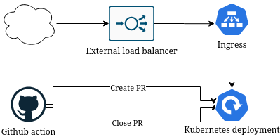

# K8S preview apps Github action

This Github action makes it easy to create PR review applications in your Kubernetes cluster.

A PR review application is a deployment that gets created with the code in the source branch of a pull request when the PR is created and that destroys it when it's merged or closed.

## How it works

The action talks to the Kubernetes API using credentials and certificates that you supply to create a deployment based on a template you supply in the repository that uses this action. The action also creates a Github deployment that tracks the Kubernetes deployment.

You need to have a wildcard domain setup that points to an ingress that runs in your cluster and that forwards traffic to the right service.



## Infrastructure setup

You need to have a K8S cluster that is publicly available and authenticates using a certificate and a token for a service account with the right permissions.

In addition, you need to have an ingress that takes traffic for a wildcard domain and redirects to the correct service.

You probably also want a controller like [certmanager](https://cert-manager.io/docs/) to generate SSL certificates.

### Examples

You probably want to set up everything and run your preview applications in a dedicated namespace. Let's create one aptly named `preview`:

``` bash
kubectl create ns preview
```

#### ServiceAccount

Then create a service account with permission to get, create, update and delete `services` and `deployments`. An example of this can be found in [configs/auth.yaml](configs/auth.yaml).

``` bash
kubectl -n preview apply -f configs/auth.yaml
```

#### SSL cert

You want a wildcard SSL certificate for the ingress.

If you use GKE you can not provision wildcard certificates for your external ingress/load balancer, a simple way to provision one is using [certmanager](https://cert-manager.io/docs/). An example of a configuration can be found in [configs/cert.yaml]. Please note that the configuration needs to be changed to have the right domain and to work with your cluster.

If you're using AWS EKS [it seems like](https://aws.amazon.com/premiumsupport/knowledge-center/terminate-https-traffic-eks-acm/) you can use an ACM certificate directly on a service with the `LoadBalancer` `type`.

#### Ingress

An example of a simple ingress based on nginx can be found in [ingress/](ingress/) and is published as a Docker image at [Dockerhub](https://hub.docker.com/r/voldern/kubernetes-preview-ingress).

To see an example of how to run the ingress on GKE with an external load balancer (ingress) look at [configs/ingress.yaml](configs/ingress.yaml).

For AWS EKS you would use the `LoadBalancer` as described above instead of the `Ingress`.

## Usage

Create a workflow in the repository of your application. For example `.github/workflows/review-app.yaml`.

An example of the workflow:

``` yaml
name: PR review app
on:
  pull_request:
    types:
      - opened
      - synchronize
      - reopened
jobs:
    run:
        runs-on: ubuntu-latest
        steps:
          - name: Checkout code
            uses: actions/checkout@master
          - name: Build application
            run: echo "Test and build your app"
            shell: bash
          - name: Docker login
            run: echo "Login to docker registry"
          - name: Construct docker image name
            id: vars
            run: echo "::set-output name=image::your-docker-image:qa-${GITHUB_SHA::8}"
            shell: bash
          - name: Build docker image
            run: docker build . -t ${{ steps.vars.outputs.image }}
          - name: Push docker image
            run: docker push ${{ steps.vars.outputs.image }}
          - uses: voldern/kubernetes-preview-github-action/deploy@v0.2.1
            with:
              GITHUB_TOKEN: ${{ secrets.GITHUB_TOKEN }}
              domain: my.domain.tld
              prefix: name-of-application
              server: ${{ secrets.K8S_SERVER }}
              token: ${{ secrets.K8S_TOKEN }}
              cert: ${{ secrets.K8S_CERT }}
              image: ${{ steps.vars.outputs.image }}
              targetPort: 8080
```

You also want to delete the applications once the PR is merge or closed. You can do that in a separate workflow, for example in `.github/workflows/cleanup.yaml`:

``` yaml
name: PR review app
on:
  pull_request:
    types:
      - closed
jobs:
    run:
        runs-on: ubuntu-latest
        steps:
          - name: Checkout code
            uses: actions/checkout@master
          - uses: voldern/kubernetes-preview-github-action/destroy@v0.2.1
            with:
              GITHUB_TOKEN: ${{ secrets.GITHUB_TOKEN }}
              prefix: name-of-application
              server: ${{ secrets.K8S_SERVER }}
              token: ${{ secrets.K8S_TOKEN }}
              cert: ${{ secrets.K8S_CERT }}
```

